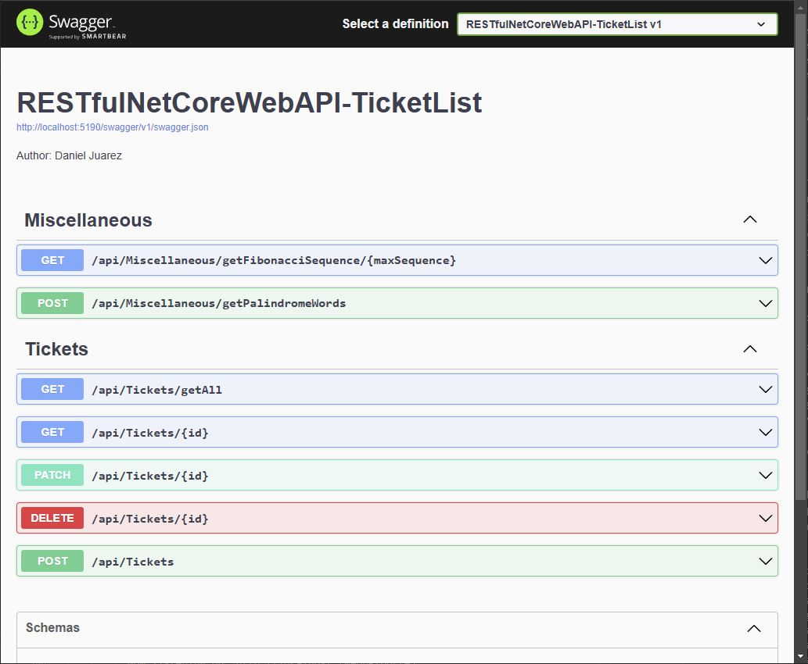
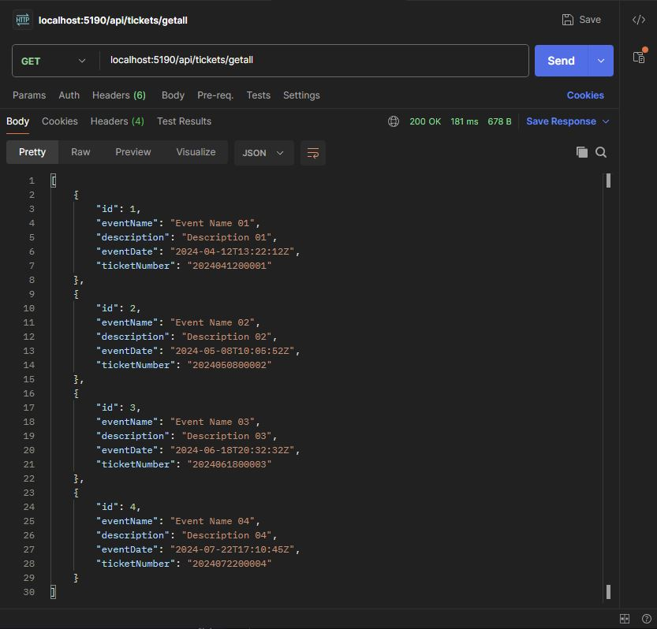

# Project C# ASP.NET Core RESTful Web API
#### Author: Daniel Juarez

## Project Overview
This project has been developed to provide technical interviewers with a comprehensive preview of a fully functional CRUD C# ASP.NET Core RESTful Web API, specifically designed for ticket services and [additional functionalities](#miscellaneous-service) outlined in the [user stories](#user-stories) section. The implementation serves as a practical demonstration of key software engineering concepts, focusing on best practices and industry standards.

Key highlights of the project include:
- **Dependency Injection**: Demonstrating the use of Dependency Injection to achieve loose coupling and enhance testability.
- **API Documentation**: Used Swagger to generate clear, concise documentation and enhance developer experience.
- **Adherence to C# Best Practices**: Following industry-standard C# coding conventions to ensure readability, maintainability, and scalability.
- **Clean Architecture Principles**: Structuring the project in alignment with Clean Architecture to promote separation of concerns and maintainable code.
- **Error Handling**: Implemented a structured exception hierarchy to enhance fault tolerance and streamline error management.
- **Extension Methods**: A valuable tool in C# that enables developers to extend the capabilities of existing types, improving code flexibility and scalability.
- **Unit Testing**: Used MS Unit Test and Moq, with flexibility to incorporate other C# test frameworks, to drive test-driven development (TDD) and ensure high code coverage.
- **Azure Deployment**: Includes Microsoft-provided step-by-step guidance for publishing the project to Azure App Services.

Throughout the interview, I will be available to explain any of these approaches in detail, discussing the rationale behind the design choices and their benefits in real-world application development.

## Technical Specifications
- **Development Environment**: Visual Studio 2022 Community Edition version 17.12.3
- **Framework**: C# 12 with .NET 8 (Long-Term Support)
- **Database**: InMemoryDatabase for easy portability and demonstration purposes

## Document Structure
This document is divided into four sections:

 1. **[Details](#details)**: Project goals, model definition, and technical requirements.

 2. **[User Stories](#user-stories)**: Elaboration of the project's expectations and functional requirements.

 3. **[Code Implementation and Setup](#code-implementation-and-setup)**: Step-by-step guide on executing the project code.

 4. **[Publishing to Azure App Service](#publishing-to-azure-app-service)**: Provides information how to deploy this project to Azure App Services.

## Details
The RESTful Web API Source Code Solution implements two primary services:<br/>
### Ticket List Service
* **CRUD Operations**:
    * **Create**: Add a new "Ticket Item" using <span style="color:ghostwhite;background-color:green;border-radius:3px;padding:1px 3px">POST</span> method with InputDTO model and AutoMapper extension.
    * **Update**: Update an existing "Ticket Item" using <span style="color:ghostwhite;background-color:mediumseagreen;border-radius:3px;padding:1px 3px">PATCH</span> method with JsonPatchDocument extension.
    * **Read**: Return a single "Ticket Item" using <span style="color:ghostwhite;background-color:dodgerblue;border-radius:3px;padding:1px 3px">GET</span> method.
    * **Read (List)**: Return a list of "Ticket Items" using <span style="color:ghostwhite;background-color:dodgerblue;border-radius:3px;padding:1px 3px">GET</span> method.
    * **Delete**: Remove a "Ticket Item" using <span style="color:ghostwhite;background-color:firebrick;border-radius:3px;padding:1px 3px">DELETE</span> method.

* **Ticket object definition**:
    * `Id`
    * `EventName`
    * `Description`
    * `EventDate` (Date and Time)
    * `TicketNumber` (Computed class property based on `EventDate` and ticket `Id`)

### Miscellaneous Service
* **Endpoints:**
    * [Fibonacci Sequence](https://en.wikipedia.org/wiki/Fibonacci_sequence): Calculate Fibonacci sequence numbers up to a specified maximum value.
    * [Palindrome](https://en.wikipedia.org/wiki/Palindrome) Words: Determine which words are palindromes from a given list of words.

## User Stories
### Ticket Services:
* As a user, I want to call a service endpoint that returns a list of Ticket items.

    - Acceptance Criteria:
        -  Done when the GET method returns a list of Ticket Items in JSON format.
    - Execute in Postman or Swagger:
        ```
        Method: GET
        Url: http://localhost:[WebAPIport#]/api/tickets/getall

        Returned: BODY
            [
                {
                    "id": 1,
                    "eventName": "Event Name 01",
                    "description": "Description 01",
                    "eventDate": "2024-04-12T13:22:12Z",
                    "ticketNumber": "2024041200001"
                },
                {
                    "id": 2,
                    "title": "Event Name 02",
                    "description": "Description 02",
                    "eventDate": "2024-05-08T10:05:52Z",
                    "ticketNumber": "2024050800002"
                },
                {
                    "id": 3,
                    "title": "Event Name 03",
                    "description": "Description 03",
                    "eventDate": "2024-06-18T20:32:32Z",
                    "ticketNumber": "2024061800003"
                },
                {
                    "id": 4,
                    "title": "Event Name 04",
                    "description": "Description 04",
                    "eventDate": "2024-07-22T17:10:45Z",
                    "ticketNumber": "2024072200004"
                }
            ]

        Status Code: 200 Ok
        ```

* As a user, I want to call a service endpoint that returns the details of a single Ticket item.
    - Acceptance Criteria:
        - Done when a GET method returns a valid Ticket item ID, Event name, Description, Event Date and Ticket number in JSON format.
    - Execute in Postman or Swagger:
        ```
        Method: GET
        Url: http://localhost:[WebAPIport#]/api/tickets/2

        Returned: BODY
            {
                "id": 2,
                "eventName": "Event Name 02",
                "description": "Description 02",
                "eventDate": "2024-05-08T10:05:52Z",
                "ticketNumber": "2024050800002"
            }

        Status Code: 200 Ok
        ```
    - Acceptance Criteria:
        - Done when GET method for a Ticket item ID that doesn't exist returns an HTTP 404 status code.
    - Execute in Postman or Swagger:
        ```
        Method: GET
        Url: http://localhost:[WebAPIport#]/api/tickets/18

        Returned: BODY
            <Error Object>

        Status Code: 404 Not Found
        ```

* As user, I want to call a service endpoint that updates a single Ticket item.
    - Acceptance Criteria:
        - Done when PATCH method to an existing item updates the Event name and Description.
    - Execute in Postman or Swagger:
        ```
        Method: PATCH
        Url: http://localhost:[WebAPIport#]/api/tickets/1

        Send: BODY -> raw -> JSON (application/json)
            [
                {
                    "op": "replace", "path": "/EventName", "value": "Event10"
                },
                {
                    "op": "replace", "path": "/Description", "value": "Description10"
                }
            ]

        Returned: BODY
            {
                "id": 1,
                "eventName": "Event10",
                "description": "Description10",
                "eventDate": "2024-04-12T13:22:12Z",
                "ticketNumber": "2024041200001"
            }

        Status Code: 200 Ok
        ```
    - Acceptance Criteria:
        - Done when PATCH method to a non-existent Ticket Item returns an HTTP 415 status code.
    - Execute in Postman:
        ```
        Method: PATCH
        Url: http://localhost:[WebAPIport#]/api/tickets/2

        Send: BODY -> raw -> JSON (application/json)
            <Nothing>

        Returned: BODY
            <Error Object>

        Status Code: 415 Unsupported Media Type
        ```

* As a user, I want to call a service endpoint that creates a new Ticket Item.
    - Acceptance Criteria:
        - Done when a successful POST method that includes Event name, Description, Event Date and Ticket number returns HTTP 201 status.
        - Done when a successful POST method returns the created object.
    - Execute in Postman or Swagger:
        ```
        Method: POST
        Url: http://localhost:[WebAPIport#]/api/tickets

        Send: BODY -> raw -> JSON (application/json)
            {
                "eventName": "Event5",
                "description": "Description5",
                "eventDate": "2024-06-17T16:50:34Z"
            }

        Returned: BODY
            {
                "id": 5,
                "eventName": "Event5",
                "description": "Description5",
                "eventDate": "2024-06-17T16:50:34Z"
                "ticketNumber": "2024061700005"
            }

        Status Code: 201 Created
        ```
    - Acceptance Criteria:
        - Done when an unsuccessful POST method due to any reason returns an HTTP 400 status code.
    - Execute in Postman:
        ```
        Method: POST
        Url: http://localhost:[WebAPIport#]/api/tickets

        Send: BODY -> raw -> JSON (application/json)
            <Nothing>

        Returned: BODY
            <Error Object>

        Status Code: 400 Bad Request
       ```

* As a user, I want to call a service endpoint that removes a Ticket Item.
    - Acceptance Criteria:
        - Done when a successful DELETE method item returns HTTP 200 status.

    - Execute in Postman or Swagger:
        ```
        Method: DELETE
        Url: http://localhost:[WebAPIport#]/api/tickets/1

        Send: BODY -> raw -> JSON (application/json)
            <Nothing>

        Returned: BODY
            <Nothing>

        Status Code: 200 Ok
        ```
    - Acceptance Criteria:
        - Done when an unsuccessful DELETE method returns an HTTP 404 status code.
    - Execute in Postman or Swagger:
        ```
        Method: DELETE
        Url: http://localhost:[WebAPIport#]/api/tickets/10

        Send: BODY -> raw -> JSON (application/json)
            <Nothing>

        Returned: BODY
            <Error Object>

        Status Code: 404 Not Found
        ```
### Miscellaneous Service
* As a user, I want to call a service endpoint to calculate and return a list of Fibonacci sequence numbers up to a specified maximal value.
    - Acceptance Criteria:
        - Done when a list of Fibonacci sequence numbers are provided as a response and HTTP 200 status is returned.
    - Execute in Postman or Swagger:
        ```
        Method: GET
        Url: http://localhost:[WebAPIport#]/api/miscellaneous/getfibonaccisequence/90

        Send: BODY -> raw -> JSON (application/json)
            <Nothing>

        Returned: BODY
            [ 0, 1, 1, 2, 3, 5, 8, 13, 21, 34, 55, 89 ]

        Status Code: 200 Ok
        ```
    - Acceptance Criteria:
        - Done when an unsupported argument is supplied, resulting in an HTTP 400 status code.
    - Execute in Postman or Swagger:
        ```
        Method: GET
        Url: http://localhost:[WebAPIport#]/api/miscellaneous/getfibonaccisequence/-1

        Send: BODY -> raw -> JSON (application/json)
            <Nothing>

        Returned: BODY
            <Error Object>

        Status Code: 400 Bad Request
        ```
* As a user, I want to call a service endpoint to identify which words from a provided list are Palindrome.
    - Acceptance Criteria:
        - Done when the service returns only the palindrome words from the provided list, if any found; otherwise, it should return an empty list with HTTP 200 status code.
    - Execute in Postman or Swagger:
        ```
        Method: POST
        Url: http://localhost:[WebAPIport#]/api/miscellaneous/getpalindromewords

        Send: BODY -> raw -> JSON (application/json)
            ['noon', 'statement', 'level']

        Returned: BODY
            ['noon', 'level']

        Status Code: 200 Ok
        ```
    - Acceptance Criteria:
        - Done when, if no word list is provided, the service will return an HTTP 400 status code with a brief description of the error. The response will also include a sample request body showing a valid list of three words, including two palindromes.
    - Execute in Postman or Swagger:
        ```
        Method: POST
        Url: http://localhost:[WebAPIport#]/api/miscellaneous/getpalindromewords

        Send: BODY -> raw -> JSON (application/json)
            <Nothing>

        Returned: BODY
            <Error Object>
            With description: "Value cannot be null. (Parameter 'words list is null or empty. Try with ['civic', 'type', 'radar'], will respond with ['civic', 'radar']')"

        Status Code: 400 Bad Request
        ```
    - Acceptance Criteria:
        - Done when, if the list of words includes a number, the service returns an HTTP 400 status code along with a brief description of the error. Additionally, the response should include a sample request body that demonstrates how to provide a valid list of 3 words, including 2 palindromes.
    - Execute in Postman or Swagger:
        ```
        Method: POST
        Url: http://localhost:[WebAPIport#]/api/miscellaneous/getpalindromewords

        Send: BODY -> raw -> JSON (application/json)
            [20, 'radar']

        Returned: BODY
            <Error Object>
            With description: "words list contain at least one element that is not allowed. Try with ['civic', 'type', 'radar'], will respond with ['civic', 'radar']"

        Status Code: 400 Bad Request
        ```
    - Acceptance Criteria:
        - Done when, if the list of words includes any word that is one character long, the service will return an HTTP 400 status code with a brief error description. The response will also include a sample request body showing a valid list of three words, including two palindromes.
    - Execute in Postman or Swagger:
        ```
        Method: POST
        Url: http://localhost:[WebAPIport#]/api/miscellaneous/getpalindromewords

        Send: BODY -> raw -> JSON (application/json)
            ['civic', 'w']

        Returned: BODY
            <Error Object>
            With description: "words list contain at least one element that is not allowed. Try with ['civic', 'type', 'radar'], will respond with ['civic', 'radar']"

        Status Code: 400 Bad Request
        ```
## Code Implementation and Setup
This project utilizes Visual Studio 2022 Community Edition and adheres to clean architecture principles, ensuring a maintainable, scalable, and testable design. The solution consists of two projects:

- **RESTfulNetCoreWebAPI-TicketList**: The RESTful Web API project.
- **RESTfulNetCoreWebAPI-TicketList.Tests.MSTest**: Unit tests for the RESTful Web API project.

### Prerequisites
* **Visual Studio 2022**: Download a free copy from the [Microsoft Visual Studio Community](https://visualstudio.microsoft.com/vs/community/) website if not already installed.


* **.NET 8.0 SDK**: Verify installation by running dotnet `--list-sdks` in your terminal. Ensure a version starting with `8` is listed. If not, install the latest [.NET 8.0 SDK](https://dotnet.microsoft.com/en-us/download).

### Running the Project
Clone the repository to your local machine using Git.

### Option 1: Visual Studio 2022
1. Open Visual Studio 2022.
2. Choose "Open a Project or Solution".
3. Select the folder containing the unzipped or cloned application and choose `RESTfulNetCoreWebAPI-TicketList.sln`.
4. Press `F5` or click on run button <<span style="color:green;border-radius:3px;padding:2px 2px 1px 1px">▶</span> http> to run the application in debug mode. <br/>
The Swagger document will open, displaying all available services:
    

### Option 2: Command Prompt
1. Open the Developer Command Prompt from Visual Studio IDE:

    Tools (top menu) -> Command Line -> Developer Command Prompt:
    ```
    **********************************************************************
    ** Visual Studio 2022 Developer Command Prompt v17.10.2
    ** Copyright (c) 2022 Microsoft Corporation
    **********************************************************************

    C:\<YourDrivePath>\RESTfulNetCoreWebAPI-TicketList>
    ```
2. Navigate to the project directory and run the following command to start the application in debug mode:

    - From the command prompt type: `cd RESTfulNetCoreWebAPI-TicketList` < Enter >
    - From the command prompt type: `dotnet run` < Enter >
        ```
        C:\<YourDrivePath>\cSharp-RestAPI-NetCore-TicketList>cd RESTfulNetCoreWebAPI-TicketList ⤶
        C:\<YourDrivePath>\cSharp-RestAPI-NetCore-TicketList\RESTfulNetCoreWebAPI-TicketList>dotnet run ⤶
        ```
    - When running the project, you should see the following output in the Command Line Console:
        ```
        Building...
        info: Microsoft.EntityFrameworkCore.Update[30100]
            Saved 4 entities to in-memory store.
        info: Microsoft.Hosting.Lifetime[14]
            Now listening on: http://localhost:[WebAPIport#]
        info: Microsoft.Hosting.Lifetime[0]
            Application started. Press Ctrl+C to shut down.
        info: Microsoft.Hosting.Lifetime[0]
            Hosting environment: Development
        info: Microsoft.Hosting.Lifetime[0]
            Content root path: C:\<YourDrivePath>\cSharp-RestAPI-NetCore-TicketList\RESTfulNetCoreWebAPI-TicketList
        ```
3. The Swagger document will not be available during this execution; however, the web API service will remain operational and can be accessed using Postman or your preferred API client:

    

## Publishing to Azure App Service
After verifying the ASP.NET Core RESTful Web API is functioning correctly, you can publish it to Azure App Service. 

Follow these steps:
1. [Create an Azure API Management instance](https://learn.microsoft.com/en-us/azure/api-management/get-started-create-service-instance): Use the Azure portal to create a new instance, if necessary.
2. [Import and publish your API](https://learn.microsoft.com/en-us/azure/api-management/import-and-publish): Import your API and publish it to Azure API Management.
3. [Create and publish a product](https://learn.microsoft.com/en-us/azure/api-management/api-management-howto-add-products?tabs=azure-portal&pivots=interactive): Create a product and publish it to Azure API Management.
4. [Authenticate your API and connector](https://learn.microsoft.com/en-us/connectors/custom-connectors/azure-active-directory-authentication): Authenticate your API and connector with Microsoft Entra ID.

By completing these steps, you can successfully publish your ASP.NET Core RESTful Web API to Azure App Service.

## Additional Resources
- Azure API Management documentation: https://docs.microsoft.com/en-us/azure/api-management/
- Azure App Service documentation: https://docs.microsoft.com/en-us/azure/app-service/
- Microsoft Entra ID documentation: https://docs.microsoft.com/en-us/azure/active-directory/

<br/>
Thank you.
