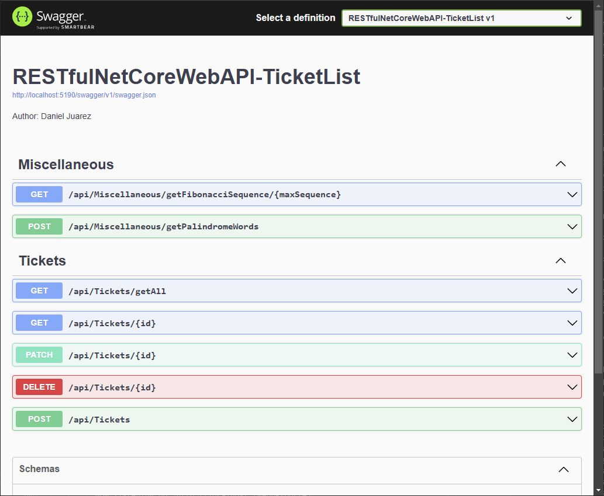
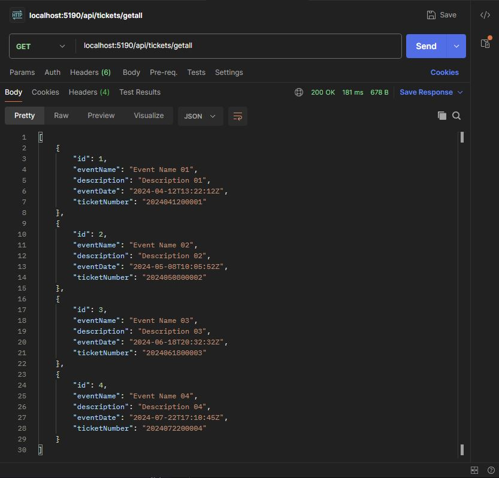

[< Return to README](../README.md)

## Running the Project Locally
The solution consists of two projects:

- **RESTfulNetCoreWebAPI-TicketList**: The RESTful Web API project.
- **RESTfulNetCoreWebAPI-TicketList.Tests.MSTest**: Unit tests for the RESTful Web API project.

### Prerequisites
* **Visual Studio 2022**: Download a free copy from the [Microsoft Visual Studio Community](https://visualstudio.microsoft.com/vs/community/) website if not already installed.


* **.NET 8.0 SDK**: Verify installation by running dotnet `--list-sdks` in your terminal. Ensure a version starting with `8` is listed. If not, install the latest [.NET 8.0 SDK](https://dotnet.microsoft.com/en-us/download).

### Running the Project
Clone the repository to your local machine using Git.

### Option 1: Visual Studio 2022
1. Open Visual Studio 2022.
2. Choose "Open a Project or Solution".
3. Select the folder containing the unzipped or cloned application and choose `RESTfulNetCoreWebAPI-TicketList.sln`.
4. Press `F5` or click on run button <<span style="color:green;border-radius:3px;padding:2px 2px 1px 1px">▶</span> http> to run the application in debug mode. <br/>
The Swagger document will open, displaying all available services:
    

### Option 2: Command Prompt
1. Open the Developer Command Prompt from Visual Studio IDE:

    Tools (top menu) -> Command Line -> Developer Command Prompt:
    ```
    **********************************************************************
    ** Visual Studio 2022 Developer Command Prompt v17.10.2
    ** Copyright (c) 2022 Microsoft Corporation
    **********************************************************************

    C:\<YourDrivePath>\RESTfulNetCoreWebAPI-TicketList>
    ```
2. Navigate to the project directory and run the following command to start the application in debug mode:

    - From the command prompt type: `cd RESTfulNetCoreWebAPI-TicketList` < Enter >
    - From the command prompt type: `dotnet run` < Enter >
        ```
        C:\<YourDrivePath>\cSharp-RestAPI-NetCore-TicketList>cd RESTfulNetCoreWebAPI-TicketList ⤶
        C:\<YourDrivePath>\cSharp-RestAPI-NetCore-TicketList\RESTfulNetCoreWebAPI-TicketList>dotnet run ⤶
        ```
    - When running the project, you should see the following output in the Command Line Console:
        ```
        Building...
        info: Microsoft.EntityFrameworkCore.Update[30100]
            Saved 4 entities to in-memory store.
        info: Microsoft.Hosting.Lifetime[14]
            Now listening on: http://localhost:[WebAPIport#]
        info: Microsoft.Hosting.Lifetime[0]
            Application started. Press Ctrl+C to shut down.
        info: Microsoft.Hosting.Lifetime[0]
            Hosting environment: Development
        info: Microsoft.Hosting.Lifetime[0]
            Content root path: C:\<YourDrivePath>\cSharp-RestAPI-NetCore-TicketList\RESTfulNetCoreWebAPI-TicketList
        ```
3. The Swagger document will not be available during this execution; however, the web API service will remain operational and can be accessed using Postman or your preferred API client:

    

---
[< Return to README](../README.md)